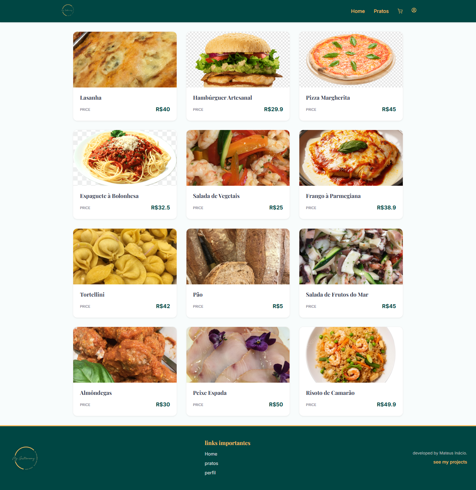
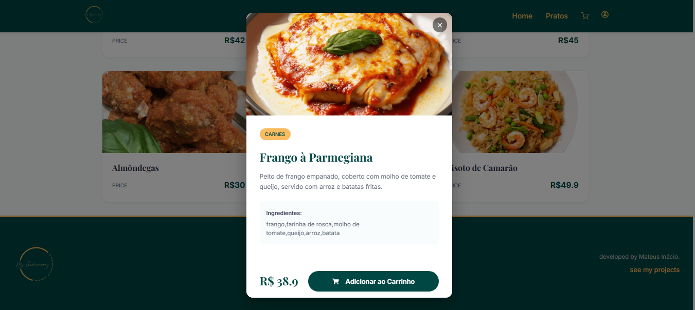
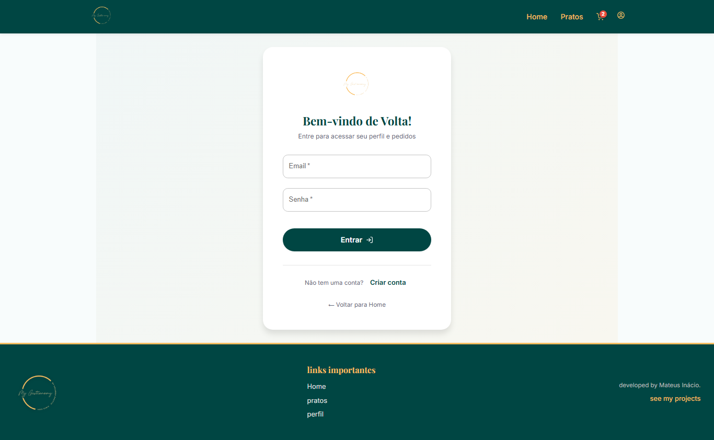
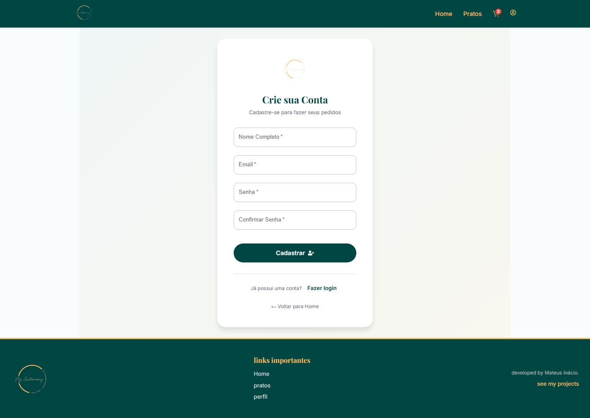
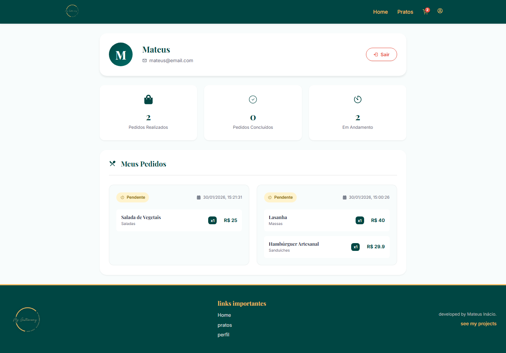

# 🍽️ MyGastronomy

Bem-vindo ao **MyGastronomy**! Este é um projeto fullstack desenvolvido para facilitar a gestão de pedidos e pratos em um ambiente gastronômico. O sistema oferece funcionalidades para gerenciamento de usuários, autenticação segura, visualização de pratos disponíveis e controle de pedidos.

Este projeto foi construído com foco em organização, performance e boas práticas de desenvolvimento web.

---

## 🚀 Tecnologias Utilizadas

### Backend
- **Node.js** & **Express**: Base sólida e flexível para a API.
- **MongoDB**: Banco de dados NoSQL para armazenamento flexível de dados.
- **JWT (JSON Web Tokens)**: Autenticação segura e stateless.
- **Bcrypt**: Hashing de senhas para segurança robusta.
- **Cors**: Gerenciamento de acessos de diferentes origens.

### Frontend
- **React.js**: Biblioteca JavaScript para construção de interfaces dinâmicas.
- **Vite**: Build tool extremamente rápida para desenvolvimento moderno.
- **Material UI (MUI)**: Componentes estilizados e responsivos para uma UI profissional.
- **React Router**: Gerenciamento de rotas e navegação SPA (Single Page Application).
- **React Icons**: Biblioteca de ícones para uma interface mais rica.

---

## ✨ Funcionalidades Principais

### 🔐 Autenticação
- Login e cadastro seguros com criptografia de senha (Bcrypt) e tokens JWT.
- **Sistema de notificações Toast**: Feedback visual elegante para todas as ações (sucesso, erro, aviso).
- Validação de formulários no frontend (campos obrigatórios, confirmação de senha, tamanho mínimo).
- Redirecionamento automático após login/cadastro.
- Mensagens de erro específicas: "Usuário já cadastrado", "Senha incorreta", "Usuário não encontrado".

### 🍕 Gestão de Pratos
- Visualização de pratos disponíveis no cardápio com grid responsivo.
- Cards de pratos com imagem, nome, categoria e preço.
- Modal de detalhes do prato com ingredientes e botão "Adicionar ao Carrinho".

### 🛒 Sistema de Pedidos
- Carrinho de compras com contexto global (React Context API).
- Histórico de pedidos no perfil do usuário.
- Status dos pedidos com badges coloridos: Pendente, Completo, Cancelado.

### 👤 Perfil do Usuário
- Dashboard com estatísticas: total de pedidos, concluídos, em andamento.
- Avatar com inicial do nome do usuário.
- Listagem detalhada de todos os pedidos realizados.

---

## 🎨 Design System

O projeto utiliza um sistema de design moderno e consistente:

### Cores
| Cor | Código | Uso |
|-----|--------|-----|
| Primary | `#004643` | Navbar, botões, títulos |
| Secondary | `#f9bc60` | Destaques, badges, hovers |
| Background | `#faf8f5` | Fundo da página |
| Surface | `#ffffff` | Cards, modais |

### Tipografia
- **Playfair Display**: Títulos e headings (elegante, gastronômico).
- **Inter**: Corpo de texto (legível, moderno).

### Animações
- Transições suaves em hovers e interações.
- Animações de entrada `fadeInUp` nas seções da Home.
- Toast notifications com slide-in da direita.

---

## 📁 Estrutura do Projeto

### Backend (`/backend`)
```
src/
├── auth/           # Autenticação JWT e middleware
├── controllers/    # Lógica de negócio
├── dataAcess/      # Camada de acesso ao MongoDB
├── database/       # Configuração de conexão
├── routes/         # Definição das rotas REST
└── helpers/        # Funções utilitárias
```

### Frontend (`/frontend`)
```
src/
├── components/
│   ├── navBar/         # Navegação principal
│   ├── footer/         # Rodapé
│   ├── plateCard/      # Card de prato
│   ├── platePopUp/     # Modal de detalhes
│   ├── Toast/          # Sistema de notificações
│   └── icons/          # Ícones SVG customizados
├── contexts/           # Context API (Cart)
├── pages/
│   ├── Home/           # Página inicial
│   ├── login/          # Login e Cadastro
│   ├── profile/        # Dashboard do usuário
│   ├── plates/         # Cardápio
│   └── cart/           # Carrinho
├── services/           # Comunicação com API
└── config.js           # URL base da API
```

---

## 🛠️ Instalação e Configuração

### Pré-requisitos
- [Node.js](https://nodejs.org/) instalado.
- [MongoDB](https://www.mongodb.com/) (ou uma string de conexão válida do MongoDB Atlas).

### 1. Configurando o Backend

```bash
cd backend
npm install
```

Crie um arquivo `.env` na raiz da pasta `backend`:
```env
MONGO_CONNECTION_STRING=sua_string_de_conexao_mongodb
MONGO_DB_NAME=nome_do_seu_banco
JWT_SECRET=seu_segredo_jwt
```

Inicie o servidor:
```bash
npm run dev
```
O backend rodará em `http://localhost:3000`.

### 2. Configurando o Frontend

```bash
cd frontend
npm install
npm run dev
```
A aplicação estará disponível em `http://localhost:5173`.

---

## 🤝 Como Usar

1. **Registre-se**: Crie uma conta na tela de registro.
2. **Faça Login**: Acesse o sistema com suas credenciais.
3. **Explore o Cardápio**: Veja os pratos disponíveis na seção de pratos.
4. **Adicione ao Carrinho**: Clique em um prato para ver detalhes e adicionar.
5. **Finalize o Pedido**: Vá ao carrinho e confirme seu pedido.
6. **Acompanhe**: Veja o status dos seus pedidos no seu perfil.

---

## 📸 Screenshots

- Página Inicial (Home)

- Cardápio de Pratos

- Modal de Detalhes do Prato

- Pagina carrinho de compras

- Tela de Login

-Tela de registro

- Perfil do Usuário com Pedidos


---

Desenvolvido por **Mateus** 🚀
